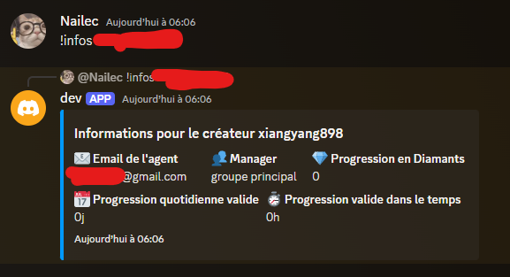

# Streamline Crawler for TikTok Live Backstage

Streamline Crawler for TikTok Live Backstage est un bot Discord conçu pour faciliter la gestion des créateurs TikTok. 

Il permet aux managers et responsables d'obtenir rapidement des informations essentielles sur un créateur, telles que :
- Email de l'agent
- Manager responsable
- Progression en diamants
- Progression quotidienne valide
- Progression valide dans le temps

Les résultats sont présentés de manière claire et structurée dans Discord.

### Exemple de résultat

#### Commande
```bash
!infos <nom_d'utilisateur>
```

#### Résultat dans Discord


Streamline Crawler est une solution sur mesure pour simplifier et optimiser la gestion quotidienne des créateurs TikTok au sein des équipes Streamline.

